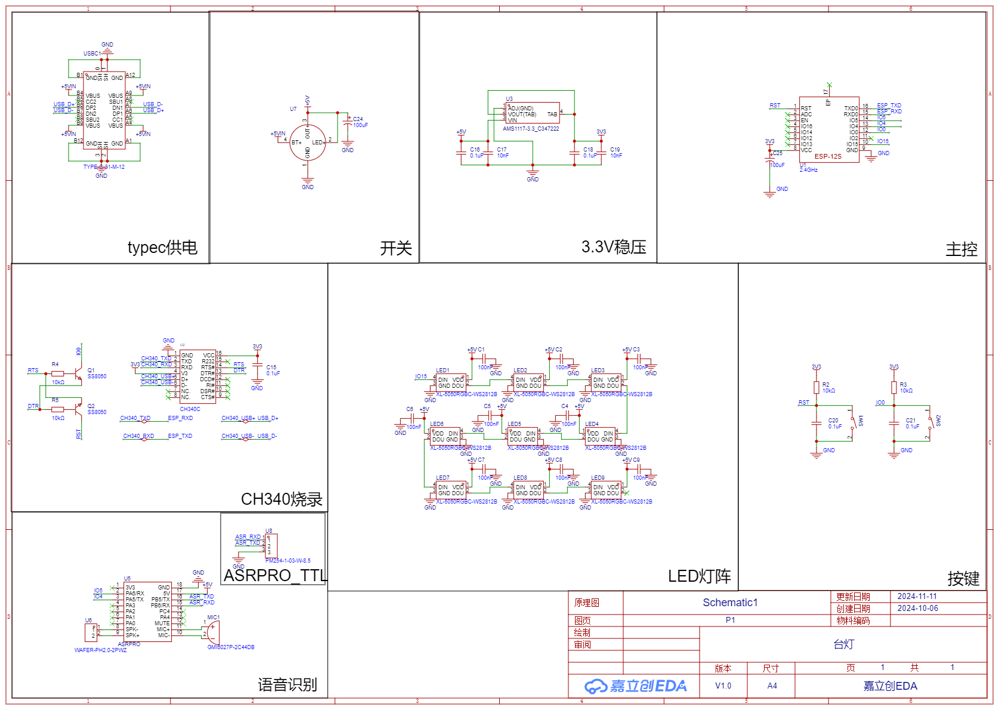

# LimitlessLED

> 一款具有无限可能的台灯，目前仅开源电路部分和用于调试的软件部分，程序正在完善，外壳有待验证，后续将陆续开源，敬请期待！

## 功能

- [x] 语音控制

- [ ] WIFI控制

- [ ] MQTT远程控制

- [x] 多种颜色任意切换

- [x] 呼吸模式

- [x] 跑马灯模式

- [x] 爆闪模式(白灯持续以hz的频率闪烁)

- [x] 救援模式(红灯持续以国际通用求救信号发出三短三长三短的闪烁)

## 渲染图

## PCB

## 原理图

